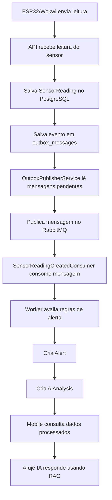

# Arujé Back-End

**Arujé** é uma API back-end desenvolvida em **.NET 8** para simular uma plataforma inteligente de monitoramento agrícola.

O nome **Arujé** representa a ideia de uma inteligência que nasce da terra, conectando sensores, dados, alertas, mensageria, observabilidade e inteligência artificial para apoiar decisões no campo.

O projeto foi construído com foco em boas práticas de arquitetura, processamento assíncrono, integração IoT, mensageria, observabilidade, autenticação, testes automatizados, execução via Docker e uso de IA generativa com RAG.

---

## Status atual

Versão atual:

```text
v1.0.3
```

Status do projeto:

```text
MVP funcional com IoT, mensageria, observabilidade, worker, mobile e RAG avançado.
```

Funcionalidades principais já implementadas:

* API REST com .NET 8
* Clean Architecture
* PostgreSQL
* Entity Framework Core
* Docker Compose
* Autenticação JWT
* BCrypt para senha
* CRUDs principais
* Integração IoT com ESP32/Wokwi
* Outbox Pattern
* RabbitMQ
* Worker Service
* Dead Letter Queue
* Alertas automáticos
* Análises inteligentes mock
* Prometheus
* Grafana
* Swagger/OpenAPI
* Testes automatizados
* RAG com Gemini
* Classificação de intenção no assistente
* Histórico de conversa no RAG
* Fallback seguro quando a IA externa falha

---

## Visão geral

A aplicação permite o gerenciamento e monitoramento de:

* Usuários
* Fazendas
* Plantações
* Sensores
* Leituras de sensores
* Alertas agrícolas
* Análises inteligentes
* Assistente virtual agrícola com RAG

Além do CRUD principal, o projeto possui um fluxo assíncrono completo usando **Outbox Pattern**, **RabbitMQ**, **Worker Service** e **Dead Letter Queue**.

A partir da versão `v1.0.3`, o projeto também conta com um assistente RAG chamado **Arujé IA**, capaz de consultar os dados do sistema e responder perguntas em linguagem natural.

---

## Objetivo do projeto

O objetivo do Arujé é demonstrar uma solução agrícola inteligente, capaz de:

* Receber dados simulados de sensores IoT
* Processar leituras ambientais da lavoura
* Identificar situações de risco
* Gerar alertas automaticamente
* Criar análises e recomendações
* Expor dados para um aplicativo mobile
* Permitir perguntas em linguagem natural usando RAG
* Demonstrar arquitetura moderna com mensageria, observabilidade e containers

---

## Arquitetura geral da solução

Fluxo macro da solução:

```text
Wokwi / ESP32
     ↓
Arujé API
     ↓
PostgreSQL
     ↓
Outbox Pattern
     ↓
RabbitMQ
     ↓
Worker Service
     ↓
Alertas + Análises IA
     ↓
Arujé Mobile
     ↓
Arujé IA / RAG / Gemini
```

---

## Arquitetura do back-end

O projeto segue uma estrutura baseada em **Clean Architecture**, separando responsabilidades entre domínio, aplicação, infraestrutura, API, worker e testes.

```text
Aruje-Back-End/
├── Aruje-Back-End/          # API ASP.NET Core
├── Aruje.Application/       # DTOs, interfaces, services, RAG e regras de aplicação
├── Aruje.Domain/            # Entidades, enums e regras de domínio
├── Aruje.Infrastructure/    # EF Core, repositories, PostgreSQL, RabbitMQ e seed
├── Aruje.Worker/            # Worker Service para processamento assíncrono
├── Aruje.Tests/             # Testes automatizados
├── monitoring/              # Prometheus e Grafana
├── Dockerfile
├── Dockerfile.worker
├── docker-compose.yml
├── .env.example
└── README.md
```

---

## Tecnologias utilizadas

### Back-end

* .NET 8
* ASP.NET Core Web API
* Entity Framework Core
* PostgreSQL
* FluentValidation
* Swagger / OpenAPI
* JWT Bearer Authentication
* BCrypt
* Dependency Injection
* Background Services

### Mensageria e processamento assíncrono

* RabbitMQ
* Worker Service
* Outbox Pattern
* Dead Letter Queue
* Retry e tratamento de falhas

### Observabilidade

* Prometheus
* Grafana
* Health Check
* Métricas da API

### Inteligência artificial

* Gemini API
* RAG
* Classificador de intenção baseado em regras
* Provider fallback baseado em regras
* Prompt engineering
* Resposta estruturada em JSON

### IoT

* Wokwi
* ESP32
* Sensores simulados
* HTTP/HTTPS
* LocalTunnel para testes externos

### DevOps e qualidade

* Docker
* Docker Compose
* GitHub Actions
* xUnit
* Moq
* FluentAssertions
* Git Flow

---

## Fluxo principal da aplicação

O fluxo de leitura dos sensores foi implementado de forma assíncrona e resiliente.



Esse fluxo evita perda de mensagens caso o RabbitMQ esteja indisponível no momento em que a API salva uma leitura.

---

## Outbox Pattern

O projeto utiliza **Outbox Pattern** para garantir consistência entre banco de dados e mensageria.

Quando uma leitura de sensor é criada, a API não publica diretamente no RabbitMQ. Em vez disso, ela salva uma mensagem pendente na tabela `outbox_messages`.

Depois, o Worker executa o `OutboxPublisherService`, que:

1. Busca mensagens pendentes na tabela `outbox_messages`
2. Publica no RabbitMQ
3. Marca a mensagem como processada usando `ProcessedAt`

Isso reduz o risco de inconsistência entre a operação salva no banco e o evento publicado na fila.

---

## RabbitMQ e DLQ

O projeto utiliza RabbitMQ para mensageria assíncrona.

Estrutura principal:

```text
Exchange principal: aruje.sensor-readings
Fila principal: sensor-reading-created
Routing key: sensor-reading.created

Exchange de erro: aruje.sensor-readings.dlx
Fila de erro: sensor-reading-created.dlq
Routing key de erro: sensor-reading.created.dead
```

Caso uma mensagem inválida ou com erro seja consumida, ela é enviada para a **Dead Letter Queue**, evitando loop infinito de reprocessamento.

---

## Worker Service

O `Aruje.Worker` é responsável pelo processamento assíncrono das mensagens.

Responsabilidades principais:

* Ler mensagens da Outbox
* Publicar eventos no RabbitMQ
* Consumir eventos de leitura criada
* Avaliar regras agrícolas
* Criar alertas
* Criar análises inteligentes
* Tratar falhas de processamento
* Enviar mensagens problemáticas para DLQ quando necessário

---

## Regras de alerta

O Worker processa as leituras dos sensores e gera alertas automaticamente com base nas regras de negócio.

Exemplos:

```text
Temperatura >= 38 e umidade do solo <= 25
→ Risco de estresse hídrico
→ Severidade alta

Temperatura >= 35
→ Temperatura elevada
→ Severidade média

Umidade do solo <= 20
→ Baixa umidade do solo
→ Severidade alta
```

Quando um alerta é gerado, o sistema também cria uma análise automatizada na tabela de análises de IA.

---

## Análises inteligentes

O projeto possui geração de análises inteligentes a partir dos alertas.

Cada análise pode conter:

* Nível de risco
* Motivo
* Recomendação
* Provider
* Data de criação
* Vínculo com alerta

Provider usado no fluxo automático do Worker:

```text
RuleBased-Mock
```

Esse provider permite demonstrar o comportamento de uma análise inteligente sem depender de uma API externa para o fluxo assíncrono principal.

---

## RAG com Gemini

A partir da versão `v1.0.3`, o projeto possui um assistente virtual agrícola com RAG.

Endpoint principal:

```http
POST /api/rag/ask
```

O RAG permite que o usuário faça perguntas em linguagem natural sobre os dados do Arujé.

Exemplos de perguntas:

```text
Por que minha lavoura está em risco?
Tem algum alerta grave agora?
O que eu devo fazer agora?
Explique de forma simples o que aconteceu.
```

---

## Como funciona o RAG

O fluxo do RAG funciona da seguinte forma:

```text
Usuário faz pergunta
        ↓
API recebe a pergunta
        ↓
Classificador identifica a intenção
        ↓
Se for saudação/ajuda, responde direto
        ↓
Se for pergunta agrícola, busca contexto no banco
        ↓
Seleciona leituras, alertas e análises relevantes
        ↓
Monta prompt com contexto recuperado
        ↓
Inclui histórico recente da conversa
        ↓
Envia para Gemini
        ↓
Recebe resposta estruturada em JSON
        ↓
Retorna answer, riskLevel, recommendation e sources
```

---

## Funcionalidades do RAG v1.0.3

Funcionalidades implementadas:

* Endpoint `POST /api/rag/ask`
* Busca de contexto em:

    * `SensorReadings`
    * `Alerts`
    * `AiAnalyses`
* Cálculo de relevância das fontes
* Retorno das fontes consultadas
* Integração com Gemini
* Provider fallback baseado em regras
* Resposta estruturada em JSON
* Classificador de intenção no back-end
* Respostas diretas para saudação e ajuda
* Suporte a histórico de conversa
* Tratamento seguro quando Gemini falha ou retorna resposta inválida

---

## Classificação de intenção

O assistente possui um classificador de intenção baseado em regras.

Intenções reconhecidas:

```text
Greeting
Help
RiskQuestion
AlertQuestion
RecommendationQuestion
SensorQuestion
AgricultureQuestion
OutOfScope
```

Exemplos:

```text
"oi"
→ Greeting
→ Resposta direta sem acionar Gemini

"Estou com dificuldade de entender os alertas"
→ Help
→ Resposta direta sem acionar Gemini

"Por que minha lavoura está em risco?"
→ RiskQuestion
→ Usa RAG + Gemini

"E agora, o que eu faço?"
→ RecommendationQuestion
→ Usa RAG + histórico da conversa
```

---

## Histórico de conversa no RAG

O endpoint aceita histórico recente da conversa por meio do campo `conversationHistory`.

Exemplo:

```json
{
  "question": "E agora, o que eu faço?",
  "maxItems": 8,
  "conversationHistory": [
    {
      "role": "user",
      "content": "Por que minha lavoura está em risco?"
    },
    {
      "role": "assistant",
      "content": "Sua lavoura está em risco por temperatura elevada e baixa umidade do solo."
    }
  ]
}
```

Esse histórico ajuda o Gemini a entender perguntas de continuação como:

```text
E agora?
O que eu faço?
Isso é grave?
E esse alerta?
```

---

## Exemplo de requisição RAG

Endpoint:

```http
POST /api/rag/ask
```

Payload:

```json
{
  "question": "Por que minha lavoura está em risco?",
  "maxItems": 8,
  "conversationHistory": []
}
```

Resposta esperada:

```json
{
  "question": "Por que minha lavoura está em risco?",
  "answer": "Sua lavoura está em risco principalmente por causa da temperatura elevada e da baixa umidade do solo.",
  "riskLevel": "Alto",
  "recommendation": "Verifique a plantação e avalie a necessidade de irrigação.",
  "provider": "Gemini-RAG",
  "sources": [
    {
      "type": "Alert",
      "id": "guid",
      "title": "Risco de estresse hídrico",
      "summary": "Alerta registrado com temperatura elevada e baixa umidade do solo.",
      "relevanceScore": 16,
      "createdAt": "2026-06-26T17:22:48.040842Z"
    }
  ],
  "generatedAt": "2026-06-26T17:32:13.8615225Z"
}
```

---

## Providers do RAG

O RAG pode retornar diferentes providers:

```text
Gemini-RAG
Aruje-Intent-RuleBased
RuleBased-RAG
```

Significado:

```text
Gemini-RAG
→ Resposta gerada pela Gemini com base no contexto recuperado.

Aruje-Intent-RuleBased
→ Resposta direta do classificador de intenção, sem consultar Gemini.

RuleBased-RAG
→ Fallback local quando a Gemini não está configurada ou falha.
```

---

## Configuração da Gemini API

O projeto utiliza variáveis de ambiente para configurar a Gemini.

Exemplo no `.env`:

```env
GEMINI_API_KEY=SUA_CHAVE_AQUI
GEMINI_MODEL=gemini-2.5-flash
```

Esses valores são repassados ao container da API pelo `docker-compose.yml`.

Importante:

```text
Nunca commitar o arquivo .env.
Nunca expor a chave da Gemini no GitHub.
Usar .env.example apenas com valores de exemplo.
```

Exemplo seguro para `.env.example`:

```env
GEMINI_API_KEY=
GEMINI_MODEL=gemini-2.5-flash
```

---

## Como rodar o projeto com Docker

### 1. Clonar o repositório

```bash
git clone https://github.com/gugomesx10/ARUJE.git
cd ARUJE
```

### 2. Criar o arquivo `.env`

Use o arquivo `.env.example` como base:

```bash
cp .env.example .env
```

Edite o `.env` com os valores desejados para PostgreSQL, JWT, RabbitMQ, Grafana e Gemini.

O arquivo `.env` não deve ser commitado.

---

### 3. Subir os containers

```bash
docker compose up -d --build
```

Esse comando sobe o ambiente completo:

```text
aruje-api
aruje-worker
aruje-postgres
aruje-rabbitmq
aruje-prometheus
aruje-grafana
```

---

### 4. Verificar os containers

```bash
docker compose ps
```

---

### 5. Verificar consumo dos containers

```bash
docker stats --no-stream
```

---

## Modo demo leve

Para desenvolvimento ou demonstração com Wokwi, pode ser útil rodar apenas os serviços essenciais.

Subir apenas API, banco e RabbitMQ:

```bash
docker compose up -d aruje-db rabbitmq aruje-api
```

Parar serviços mais pesados temporariamente:

```bash
docker compose stop grafana prometheus aruje-worker
```

Esse modo mantém:

```text
API
PostgreSQL
RabbitMQ
```

E pausa:

```text
Grafana
Prometheus
Worker
```

Para religar tudo:

```bash
docker compose up -d
```

---

## Portas da aplicação

| Serviço             | URL                           |
| ------------------- | ----------------------------- |
| API                 | http://localhost:8080         |
| Swagger             | http://localhost:8080/swagger |
| Health Check        | http://localhost:8080/health  |
| Métricas            | http://localhost:8080/metrics |
| RabbitMQ Management | http://localhost:15672        |
| Prometheus          | http://localhost:9090         |
| Grafana             | http://localhost:3000         |
| PostgreSQL          | localhost:5433                |

---

## Health check

A API possui endpoint de health check:

```http
GET /health
```

Exemplo:

```bash
curl http://localhost:8080/health
```

Esse endpoint valida a disponibilidade da aplicação e conexão com o banco.

---

## Usuário demo

Quando o seed de demonstração está habilitado no Docker Compose, a aplicação cria dados iniciais para teste.

Usuário demo:

```text
Email: gustavo@aruje.com
Senha: Aruje123@
Perfil: Admin
```

Essas credenciais são apenas para ambiente de demonstração.

---

## Seed de demonstração

O projeto possui seed automático para facilitar testes e demonstrações.

O seed cria:

* Usuário admin
* Fazenda demo
* Plantação demo
* Sensores demo
* Leituras normais
* Leituras críticas
* Mensagens na Outbox

As mensagens criadas na Outbox são processadas pelo Worker, que publica no RabbitMQ e gera alertas e análises automaticamente.

Para habilitar o seed no Docker, o serviço `aruje-api` deve conter:

```yaml
Seed__DemoData: "true"
```

---

## Autenticação

A API utiliza autenticação JWT.

Fluxo básico:

1. Criar ou usar um usuário existente
2. Fazer login em `/api/auth/login`
3. Copiar o token JWT retornado
4. Clicar em **Authorize** no Swagger
5. Inserir:

```text
Bearer SEU_TOKEN_AQUI
```

---

## Exemplo de login

Endpoint:

```http
POST /api/auth/login
```

Payload:

```json
{
  "email": "gustavo@aruje.com",
  "password": "Aruje123@"
}
```

Resposta esperada:

```json
{
  "userId": "guid",
  "fullName": "Gustavo Gomes",
  "email": "gustavo@aruje.com",
  "role": "Admin",
  "token": "jwt-token"
}
```

---

## Principais endpoints

### Auth

```http
POST /api/auth/login
GET  /api/auth/me
```

### Users

```http
GET    /api/users
GET    /api/users/{id}
POST   /api/users
PUT    /api/users/{id}
PATCH  /api/users/{id}/role
PATCH  /api/users/{id}/password
DELETE /api/users/{id}
```

### Farms

```http
GET    /api/farms
GET    /api/farms/{id}
POST   /api/farms
PUT    /api/farms/{id}
DELETE /api/farms/{id}
```

### Crops

```http
GET    /api/crops
GET    /api/crops/{id}
GET    /api/crops/farm/{farmId}
POST   /api/crops
PUT    /api/crops/{id}
DELETE /api/crops/{id}
```

### Sensors

```http
GET    /api/sensors
GET    /api/sensors/{id}
GET    /api/sensors/crop/{cropId}
POST   /api/sensors
PUT    /api/sensors/{id}
DELETE /api/sensors/{id}
```

### Sensor Readings

```http
GET    /api/sensor-readings
GET    /api/sensor-readings/{id}
GET    /api/sensor-readings/sensor/{sensorId}
GET    /api/sensor-readings/sensor/{sensorId}/latest
POST   /api/sensor-readings
DELETE /api/sensor-readings/{id}
```

### Alerts

```http
GET    /api/alerts
GET    /api/alerts/{id}
GET    /api/alerts/status/{status}
GET    /api/alerts/severity/{severity}
PATCH  /api/alerts/{id}/start-processing
PATCH  /api/alerts/{id}/resolve
PATCH  /api/alerts/{id}/close
DELETE /api/alerts/{id}
```

### AI Analyses

```http
GET    /api/ai-analyses
GET    /api/ai-analyses/{id}
GET    /api/ai-analyses/alert/{alertId}
DELETE /api/ai-analyses/{id}
```

### RAG Assistant

```http
POST /api/rag/ask
```

---

## Exemplo de criação de leitura crítica

Endpoint:

```http
POST /api/sensor-readings
```

Payload:

```json
{
  "sensorId": "COLOQUE-O-ID-DO-SENSOR-AQUI",
  "temperature": 38.5,
  "airHumidity": 42,
  "soilMoisture": 18,
  "luminosity": 760,
  "readingDate": "2026-06-21T15:30:00Z"
}
```

Essa leitura deve gerar:

```text
SensorReading
OutboxMessage
Mensagem no RabbitMQ
Alert
AiAnalysis
```

---

## Integração com Wokwi e ESP32

O projeto pode receber leituras de sensores simuladas pelo Wokwi com ESP32.

Fluxo:

```text
ESP32 conecta no Wi-Fi simulado
        ↓
Lê valores simulados
        ↓
Monta payload JSON
        ↓
Envia POST para a API
        ↓
API salva leitura
        ↓
Worker processa alertas e análises
```

Para testar localmente com Wokwi, é comum expor a API local com LocalTunnel.

Gerar URL pública temporária:

```bash
npx localtunnel --port 8080
```

Exemplo de URL gerada:

```text
https://sua-url-temporaria.loca.lt
```

No código do Wokwi, usar a URL pública no lugar de `localhost`:

```cpp
const char* apiUrl = "https://sua-url-temporaria.loca.lt/api/sensor-readings";
```

Importante:

```text
O Wokwi não consegue acessar http://localhost:8080 do computador diretamente.
Para simular envio externo, use uma URL pública temporária como LocalTunnel.
```

---

## Observabilidade

O projeto possui observabilidade com Prometheus e Grafana.

A API expõe métricas em:

```http
GET /metrics
```

Prometheus coleta métricas da API e o Grafana exibe dashboards para acompanhamento.

Métricas monitoradas:

* Status da API
* Total de requisições
* Requests por segundo
* Requests por endpoint
* Erros 4xx e 5xx
* Tempo de resposta p95

---

## Grafana

A interface do Grafana fica disponível em:

```text
http://localhost:3000
```

Uso esperado:

* Visualizar saúde da API
* Acompanhar volume de requisições
* Verificar erros HTTP
* Observar tempo de resposta
* Demonstrar observabilidade da solução

---

## Prometheus

A interface do Prometheus fica disponível em:

```text
http://localhost:9090
```

Uso esperado:

* Consultar métricas expostas pela API
* Validar coleta de métricas
* Servir como fonte de dados para o Grafana

---

## Testes automatizados

Para rodar os testes:

```bash
dotnet test
```

Para buildar a solução:

```bash
dotnet build
```

---

## Docker

### Build da API

```bash
docker build -t aruje-api -f Dockerfile .
```

### Build do Worker

```bash
docker build -t aruje-worker -f Dockerfile.worker .
```

### Subir ambiente completo

```bash
docker compose up -d --build
```

### Parar containers sem apagar dados

```bash
docker compose stop
```

### Derrubar containers sem apagar volumes

```bash
docker compose down
```

### Derrubar containers apagando volumes

```bash
docker compose down -v --remove-orphans
```

Atenção:

```text
O comando docker compose down -v remove volumes e apaga dados do PostgreSQL, RabbitMQ e Grafana.
Use apenas quando quiser recriar o ambiente do zero.
```

### Limpeza completa do Docker

```bash
docker compose down -v --remove-orphans
docker system prune -a --volumes -f
docker builder prune -a -f
wsl --shutdown
```

Use essa limpeza apenas em casos de ambiente corrompido ou quando quiser baixar e recriar tudo novamente.

---

## Banco de dados

O projeto utiliza PostgreSQL.

No Docker Compose, o banco é exposto em:

```text
Host: localhost
Porta: 5433
Database: aruje_db
User: aruje
```

As migrations são aplicadas pelo Entity Framework Core.

Comando para aplicar migrations manualmente:

```bash
dotnet ef database update --project Aruje.Infrastructure --startup-project Aruje-Back-End
```

---

## Migrations

Para criar uma nova migration:

```bash
dotnet ef migrations add NomeDaMigration --project Aruje.Infrastructure --startup-project Aruje-Back-End
```

Para atualizar o banco:

```bash
dotnet ef database update --project Aruje.Infrastructure --startup-project Aruje-Back-End
```

---

## Variáveis de ambiente

O projeto utiliza variáveis de ambiente para configurar banco, JWT, RabbitMQ, Grafana, seed e Gemini.

Exemplo de `.env.example`:

```env
POSTGRES_DB=aruje_db
POSTGRES_USER=aruje
POSTGRES_PASSWORD=aruje123

JWT__KEY=sua-chave-jwt-de-desenvolvimento
JWT__ISSUER=Aruje
JWT__AUDIENCE=ArujeUsers

RABBITMQ_DEFAULT_USER=aruje
RABBITMQ_DEFAULT_PASS=aruje123

GRAFANA_ADMIN_USER=admin
GRAFANA_ADMIN_PASSWORD=admin

SEED__DEMODATA=true

GEMINI_API_KEY=
GEMINI_MODEL=gemini-2.5-flash
```

Importante:

```text
O arquivo .env real não deve ser commitado.
Use .env.example apenas como referência.
Não exponha chaves reais no GitHub.
```

---

## CI/CD

O projeto possui workflows no GitHub Actions para:

* Restaurar dependências
* Buildar a solução
* Rodar testes
* Validar build Docker da API
* Validar build Docker do Worker
* Publicar imagens Docker no GitHub Container Registry

As imagens geradas são:

```text
ghcr.io/gugomesx10/aruje-api
ghcr.io/gugomesx10/aruje-worker
```

---

## Segurança

Boas práticas aplicadas:

* Autenticação JWT
* Senhas com hash usando BCrypt
* `.env` ignorado pelo Git
* `.env.example` usado como referência
* Chave da Gemini fora do código-fonte
* Perfis de usuário com roles
* Endpoints protegidos por autorização
* Configurações sensíveis via variáveis de ambiente
* Tratamento global de erros
* Separação de responsabilidades por camadas

---

## Padrões aplicados

* Clean Architecture
* Repository Pattern
* Unit of Work
* DTO Pattern
* Service Layer
* Outbox Pattern
* Background Worker
* Dead Letter Queue
* Dependency Injection
* Middleware global de erros
* Health Check
* Observabilidade com métricas
* RAG
* Fallback Provider
* Prompt Builder
* Context Builder
* Intent Classifier

---

## Git Flow

O projeto segue um fluxo baseado em branches:

```text
main        → versão estável
develop     → desenvolvimento
feature/*   → novas funcionalidades
release/*   → preparação de release
hotfix/*     → correções urgentes
```

Exemplo de criação de feature:

```bash
git checkout develop
git pull origin develop
git checkout -b feature/nome-da-feature
```

Commit:

```bash
git add .
git commit -m "feat: descricao da funcionalidade"
```

Merge na develop:

```bash
git checkout develop
git pull origin develop
git merge --no-ff feature/nome-da-feature -m "merge: nome da feature"
git push origin develop
```

---

## Releases

Exemplo de criação de release:

```bash
git checkout develop
git pull origin develop
git checkout -b release/v1.0.3
dotnet build
git push origin release/v1.0.3
```

Merge na main:

```bash
git checkout main
git pull origin main
git merge --no-ff release/v1.0.3 -m "release: v1.0.3"
git push origin main
```

Criar tag:

```bash
git tag -a v1.0.3 -m "v1.0.3 - RAG avancado com historico e intencao"
git push origin v1.0.3
```

Voltar a release para develop:

```bash
git checkout develop
git merge --no-ff release/v1.0.3 -m "merge: release v1.0.3 em develop"
git push origin develop
```

---

## Histórico de versões

### v1.0.3

Principais entregas:

* RAG avançado
* Integração com Gemini
* Classificador de intenção
* Histórico de conversa no request
* Histórico de conversa no prompt
* Respostas diretas para saudação e ajuda
* Fallback seguro quando Gemini falha
* Correção para resposta JSON estruturada
* Integração com mobile enviando histórico real da conversa

### v1.0.2

Principais entregas:

* Endpoint inicial do RAG
* Context Builder
* Prompt Builder
* Provider Gemini
* Provider fallback baseado em regras
* Retorno de fontes consultadas
* Integração inicial com o mobile

### v1.0.1

Principais entregas:

* Ajustes no fluxo mobile/back-end
* Melhorias em endpoints
* Refinamentos de integração

### v1.0.0

Principais entregas:

* MVP inicial
* API REST
* Banco PostgreSQL
* Autenticação JWT
* CRUDs principais
* Docker Compose
* Worker
* RabbitMQ
* Outbox Pattern
* Observabilidade

---

## Demonstração sugerida

Para demonstrar o projeto completo:

1. Subir os containers com Docker Compose
2. Abrir o Swagger
3. Testar `/health`
4. Fazer login com o usuário demo
5. Consultar fazendas, plantações e sensores criados pelo seed
6. Rodar o Wokwi com ESP32
7. Enviar leitura crítica para a API
8. Mostrar a leitura criada em `SensorReadings`
9. Mostrar a mensagem sendo criada na Outbox
10. Mostrar o RabbitMQ com fila principal
11. Mostrar o Worker processando a mensagem
12. Mostrar Alert gerado automaticamente
13. Mostrar AiAnalysis gerada automaticamente
14. Abrir o mobile e visualizar os dados processados
15. Abrir o chat Arujé IA
16. Perguntar: `Por que minha lavoura está em risco?`
17. Perguntar: `E agora, o que eu faço?`
18. Mostrar que o RAG usa fontes reais do sistema
19. Abrir Grafana e mostrar métricas da API

---

## Testes sugeridos do RAG

### Teste 1 — Saudação

Endpoint:

```http
POST /api/rag/ask
```

Payload:

```json
{
  "question": "oi",
  "maxItems": 8,
  "conversationHistory": []
}
```

Resultado esperado:

```text
provider: Aruje-Intent-RuleBased
sources: []
answer: resposta simples de saudação
```

---

### Teste 2 — Ajuda

Payload:

```json
{
  "question": "Estou com dificuldade de entender os alertas, pode me ajudar?",
  "maxItems": 8,
  "conversationHistory": []
}
```

Resultado esperado:

```text
provider: Aruje-Intent-RuleBased
sources: []
answer: explicação simples sobre como perguntar
```

---

### Teste 3 — Pergunta real com RAG

Payload:

```json
{
  "question": "Por que minha lavoura está em risco?",
  "maxItems": 8,
  "conversationHistory": []
}
```

Resultado esperado:

```text
provider: Gemini-RAG
sources: SensorReading, Alert ou AiAnalysis
riskLevel: Alto, Médio, Baixo ou Indefinido
answer: resposta limpa, sem JSON quebrado
```

---

### Teste 4 — Pergunta de continuação

Payload:

```json
{
  "question": "E agora, o que eu faço?",
  "maxItems": 8,
  "conversationHistory": [
    {
      "role": "user",
      "content": "Por que minha lavoura está em risco?"
    },
    {
      "role": "assistant",
      "content": "Sua lavoura está em risco por temperatura elevada e baixa umidade do solo."
    }
  ]
}
```

Resultado esperado:

```text
provider: Gemini-RAG
answer: entende que a pergunta se refere ao risco anterior
recommendation: recomenda verificar irrigação ou intervenção manual
```

---

## Solução de problemas

### API não responde

Verificar containers:

```bash
docker compose ps
```

Ver logs da API:

```bash
docker compose logs aruje-api --tail=100
```

Testar health check:

```bash
curl http://localhost:8080/health
```

---

### RabbitMQ consumindo muita CPU

Ver consumo:

```bash
docker stats --no-stream
```

Recriar apenas o RabbitMQ:

```bash
docker compose rm -sf rabbitmq
docker compose up -d rabbitmq
```

Parar serviços não essenciais durante desenvolvimento:

```bash
docker compose stop grafana prometheus aruje-worker
```

---

### Wokwi não consegue acessar API

O Wokwi não acessa `localhost` do computador diretamente.

Usar LocalTunnel:

```bash
npx localtunnel --port 8080
```

Depois trocar a URL no código do ESP32 para:

```text
https://sua-url-temporaria.loca.lt
```

---

### Gemini não responde

Verificar se a chave está configurada:

```env
GEMINI_API_KEY=SUA_CHAVE_AQUI
GEMINI_MODEL=gemini-2.5-flash
```

Se a chave não estiver configurada ou a chamada falhar, o sistema utiliza fallback baseado em regras.

---

### Resposta do RAG veio pelo fallback

Possíveis causas:

* `GEMINI_API_KEY` ausente
* Chave inválida
* Erro temporário na API Gemini
* Resposta inválida da IA
* Falha de rede no container

O fallback garante que o usuário continue recebendo uma resposta útil.

---

## Próximas melhorias

Possíveis melhorias futuras:

* Cache para perguntas frequentes no RAG
* Ranking de fontes por intenção
* Filtros avançados por período no RAG
* Melhorar explicabilidade das fontes
* Dashboard específico para RAG
* Histórico persistido de conversas
* Tela administrativa para prompts
* Melhorias no Worker
* Retry mais avançado para filas
* Deploy em cloud
* Azure Container Apps
* Banco gerenciado
* Build mobile com EAS
* Testes de integração com containers

---

## Autor

Desenvolvido por **Gustavo Gomes**.

GitHub: [@gugomesx10](https://github.com/gugomesx10)

Projeto criado para fins acadêmicos, estudo de arquitetura, integração IoT, mensageria, observabilidade, inteligência artificial e composição de portfólio na área de desenvolvimento de software.

---

## Licença

Este projeto foi desenvolvido para fins de estudo, portfólio e prática de arquitetura back-end com .NET.
