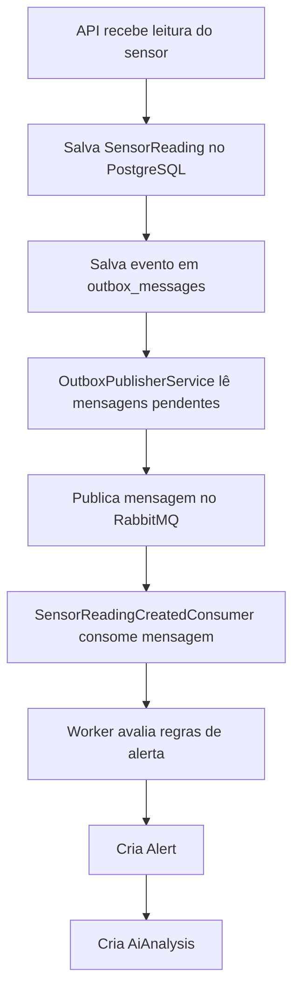

# Arujé Back-End

**Arujé** é uma API back-end desenvolvida em **.NET 8** para simular uma plataforma inteligente de monitoramento agrícola.

O nome **Arujé** representa a ideia de uma inteligência que nasce da terra, conectando sensores, dados, alertas e análise automatizada para apoiar decisões no campo.

O projeto foi construído com foco em boas práticas de arquitetura, mensageria, observabilidade, testes automatizados e execução via Docker.

---

## Visão geral

A aplicação permite o gerenciamento de:

* Usuários
* Fazendas
* Plantações
* Sensores
* Leituras de sensores
* Alertas agrícolas
* Análises automatizadas por IA mock

Além do CRUD principal, o projeto possui um fluxo assíncrono completo usando **Outbox Pattern**, **RabbitMQ**, **Worker Service** e **Dead Letter Queue**.

---

## Arquitetura

O projeto segue uma estrutura baseada em **Clean Architecture**, separando responsabilidades entre domínio, aplicação, infraestrutura, API, worker e testes.

```text
Aruje-Back-End/
├── Aruje-Back-End/          # API ASP.NET Core
├── Aruje.Application/       # DTOs, interfaces, services e regras de aplicação
├── Aruje.Domain/            # Entidades, enums e regras de domínio
├── Aruje.Infrastructure/    # EF Core, repositories, PostgreSQL, RabbitMQ e seed
├── Aruje.Worker/            # Worker Service para processamento assíncrono
├── Aruje.Tests/             # Testes automatizados
├── monitoring/              # Prometheus e Grafana
├── Dockerfile
├── Dockerfile.worker
├── docker-compose.yml
└── README.md
```

---

## Tecnologias utilizadas

* .NET 8
* ASP.NET Core Web API
* Entity Framework Core
* PostgreSQL
* RabbitMQ
* Worker Service
* JWT Bearer Authentication
* BCrypt
* Swagger / OpenAPI
* FluentValidation
* Docker
* Docker Compose
* Prometheus
* Grafana
* GitHub Actions
* xUnit
* Moq
* FluentAssertions

---

## Fluxo principal da aplicação

O fluxo de leitura dos sensores foi implementado de forma assíncrona e resiliente.



Esse fluxo evita perda de mensagens caso o RabbitMQ esteja indisponível no momento em que a API salva uma leitura.

---

## Outbox Pattern

O projeto utiliza **Outbox Pattern** para garantir consistência entre banco de dados e mensageria.

Quando uma leitura de sensor é criada, a API não publica diretamente no RabbitMQ. Em vez disso, ela salva uma mensagem pendente na tabela `outbox_messages`.

Depois, o Worker executa o `OutboxPublisherService`, que:

1. Busca mensagens pendentes na tabela `outbox_messages`
2. Publica no RabbitMQ
3. Marca a mensagem como processada usando `ProcessedAt`

Isso reduz o risco de inconsistência entre a operação salva no banco e o evento publicado na fila.

---

## RabbitMQ e DLQ

O projeto utiliza RabbitMQ para mensageria assíncrona.

Estrutura principal:

```text
Exchange principal: aruje.sensor-readings
Fila principal: sensor-reading-created
Routing key: sensor-reading.created

Exchange de erro: aruje.sensor-readings.dlx
Fila de erro: sensor-reading-created.dlq
Routing key de erro: sensor-reading.created.dead
```

Caso uma mensagem inválida ou com erro seja consumida, ela é enviada para a **Dead Letter Queue**, evitando loop infinito de reprocessamento.

---

## Regras de alerta

O Worker processa as leituras dos sensores e gera alertas automaticamente com base nas regras de negócio.

Exemplos:

```text
Temperatura >= 38 e umidade do solo <= 25
→ Risco de estresse hídrico
→ Severidade alta

Temperatura >= 35
→ Temperatura elevada
→ Severidade média

Umidade do solo <= 20
→ Baixa umidade do solo
→ Severidade alta
```

Quando um alerta é gerado, o sistema também cria uma análise automatizada mock na tabela de análises de IA.

---

## Como rodar o projeto com Docker

### 1. Clonar o repositório

```bash
git clone https://github.com/gugomesx10/ARUJE.git
cd ARUJE
```

### 2. Criar o arquivo `.env`

Use o arquivo `.env.example` como base:

```bash
cp .env.example .env
```

Edite o `.env` com os valores desejados para PostgreSQL, JWT, RabbitMQ e Grafana.

O arquivo `.env` não deve ser commitado.

---

### 3. Subir os containers

```bash
docker compose up -d --build
```

Esse comando sobe:

```text
aruje-api
aruje-worker
aruje-db
rabbitmq
prometheus
grafana
```

---

### 4. Verificar os containers

```bash
docker compose ps
```

---

## Portas da aplicação

| Serviço             | URL                           |
| ------------------- | ----------------------------- |
| API                 | http://localhost:8080         |
| Swagger             | http://localhost:8080/swagger |
| RabbitMQ Management | http://localhost:15672        |
| Prometheus          | http://localhost:9090         |
| Grafana             | http://localhost:3000         |
| PostgreSQL          | localhost:5433                |

---

## Usuário demo

Quando o seed de demonstração está habilitado no Docker Compose, a aplicação cria dados iniciais para teste.

Usuário demo:

```text
Email: gustavo@aruje.com
Senha: Aruje123@
Perfil: Admin
```

---

## Seed de demonstração

O projeto possui seed automático para facilitar testes e demonstrações.

O seed cria:

* Usuário admin
* Fazenda demo
* Plantação demo
* Sensores demo
* Leituras normais
* Leituras críticas
* Mensagens na Outbox

As mensagens criadas na Outbox são processadas pelo Worker, que publica no RabbitMQ e gera alertas e análises automaticamente.

Para habilitar o seed no Docker, o serviço `aruje-api` deve conter:

```yaml
Seed__DemoData: "true"
```

---

## Autenticação

A API utiliza autenticação JWT.

Fluxo básico:

1. Criar ou usar um usuário existente
2. Fazer login em `/api/auth/login`
3. Copiar o token JWT retornado
4. Clicar em **Authorize** no Swagger
5. Inserir:

```text
Bearer SEU_TOKEN_AQUI
```

---

## Exemplo de login

Endpoint:

```http
POST /api/auth/login
```

Payload:

```json
{
  "email": "gustavo@aruje.com",
  "password": "Aruje123@"
}
```

Resposta esperada:

```json
{
  "userId": "guid",
  "fullName": "Gustavo Gomes",
  "email": "gustavo@aruje.com",
  "role": "Admin",
  "token": "jwt-token"
}
```

---

## Principais endpoints

### Auth

```http
POST /api/auth/login
GET /api/auth/me
```

### Users

```http
GET /api/users
GET /api/users/{id}
POST /api/users
PUT /api/users/{id}
PATCH /api/users/{id}/role
PATCH /api/users/{id}/password
DELETE /api/users/{id}
```

### Farms

```http
GET /api/farms
GET /api/farms/{id}
POST /api/farms
PUT /api/farms/{id}
DELETE /api/farms/{id}
```

### Crops

```http
GET /api/crops
GET /api/crops/{id}
GET /api/crops/farm/{farmId}
POST /api/crops
PUT /api/crops/{id}
DELETE /api/crops/{id}
```

### Sensors

```http
GET /api/sensors
GET /api/sensors/{id}
GET /api/sensors/crop/{cropId}
POST /api/sensors
PUT /api/sensors/{id}
DELETE /api/sensors/{id}
```

### Sensor Readings

```http
GET /api/sensor-readings
GET /api/sensor-readings/{id}
GET /api/sensor-readings/sensor/{sensorId}
GET /api/sensor-readings/sensor/{sensorId}/latest
POST /api/sensor-readings
DELETE /api/sensor-readings/{id}
```

### Alerts

```http
GET /api/alerts
GET /api/alerts/{id}
GET /api/alerts/status/{status}
GET /api/alerts/severity/{severity}
PATCH /api/alerts/{id}/start-processing
PATCH /api/alerts/{id}/resolve
PATCH /api/alerts/{id}/close
DELETE /api/alerts/{id}
```

### AI Analyses

```http
GET /api/ai-analyses
GET /api/ai-analyses/{id}
GET /api/ai-analyses/alert/{alertId}
DELETE /api/ai-analyses/{id}
```

---

## Exemplo de criação de leitura crítica

Endpoint:

```http
POST /api/sensor-readings
```

Payload:

```json
{
  "sensorId": "COLOQUE-O-ID-DO-SENSOR-AQUI",
  "temperature": 38.5,
  "airHumidity": 42,
  "soilMoisture": 18,
  "luminosity": 760,
  "readingDate": "2026-06-21T15:30:00Z"
}
```

Essa leitura deve gerar:

```text
SensorReading
OutboxMessage
Mensagem no RabbitMQ
Alert
AiAnalysis
```

---

## Observabilidade

O projeto possui observabilidade com Prometheus e Grafana.

A API expõe métricas em:

```http
GET /metrics
```

Prometheus coleta métricas da API e o Grafana exibe dashboards para acompanhamento.

Métricas monitoradas:

* Status da API
* Total de requisições
* Requests por segundo
* Requests por endpoint
* Erros 4xx e 5xx
* Tempo de resposta p95

---

## Health check

A API possui endpoint de health check:

```http
GET /health
```

Esse endpoint valida a disponibilidade da aplicação e conexão com o banco.

---

## Testes automatizados

Para rodar os testes:

```bash
dotnet test
```

Para buildar a solução:

```bash
dotnet build
```

---

## Docker

### Build da API

```bash
docker build -t aruje-api -f Dockerfile .
```

### Build do Worker

```bash
docker build -t aruje-worker -f Dockerfile.worker .
```

### Subir ambiente completo

```bash
docker compose up -d --build
```

### Parar containers sem apagar dados

```bash
docker compose stop
```

### Derrubar containers sem apagar volumes

```bash
docker compose down
```

Evite usar:

```bash
docker compose down -v
```

Esse comando remove volumes e apaga dados do PostgreSQL, RabbitMQ e Grafana.

---

## Banco de dados

O projeto utiliza PostgreSQL.

No Docker Compose, o banco é exposto em:

```text
Host: localhost
Porta: 5433
Database: aruje_db
User: aruje
```

As migrations são aplicadas pelo Entity Framework Core.

Comando para aplicar migrations manualmente:

```bash
dotnet ef database update --project Aruje.Infrastructure --startup-project Aruje-Back-End
```

---

## Migrations

Para criar uma nova migration:

```bash
dotnet ef migrations add NomeDaMigration --project Aruje.Infrastructure --startup-project Aruje-Back-End
```

Para atualizar o banco:

```bash
dotnet ef database update --project Aruje.Infrastructure --startup-project Aruje-Back-End
```

---

## CI/CD

O projeto possui workflows no GitHub Actions para:

* Restaurar dependências
* Buildar a solução
* Rodar testes
* Validar build Docker da API
* Validar build Docker do Worker
* Publicar imagens Docker no GitHub Container Registry

As imagens geradas são:

```text
ghcr.io/gugomesx10/aruje-api
ghcr.io/gugomesx10/aruje-worker
```

---

## Segurança

Boas práticas aplicadas:

* Autenticação JWT
* Senhas com hash usando BCrypt
* `.env` ignorado pelo Git
* `.env.example` usado como referência
* Perfis de usuário com roles
* Endpoints protegidos por autorização
* Configurações sensíveis fora do código-fonte

---

## Padrões aplicados

* Clean Architecture
* Repository Pattern
* Unit of Work
* DTO Pattern
* Service Layer
* Outbox Pattern
* Background Worker
* Dead Letter Queue
* Dependency Injection
* Middleware global de erros
* Health Check
* Observabilidade com métricas

---

## Demonstração sugerida

Para demonstrar o projeto:

1. Subir os containers com Docker Compose
2. Abrir o Swagger
3. Fazer login com o usuário demo
4. Consultar fazendas, plantações e sensores criados pelo seed
5. Criar uma leitura crítica de sensor
6. Mostrar a mensagem sendo criada na Outbox
7. Mostrar o Worker publicando no RabbitMQ
8. Mostrar o Worker gerando Alert e AiAnalysis
9. Abrir o RabbitMQ e mostrar a fila principal e a DLQ
10. Abrir Grafana e mostrar o dashboard da API

---

## Status do projeto

O Arujé está funcional com:

* API REST
* Banco PostgreSQL
* Autenticação JWT
* CRUDs principais
* Processamento assíncrono
* RabbitMQ
* DLQ
* Outbox Pattern
* Worker Service
* Seed de demonstração
* Observabilidade
* Testes automatizados
* Docker Compose
* CI/CD

---

## Autor

Desenvolvido por **Gustavo Gomes**.

GitHub: [@gugomesx10](https://github.com/gugomesx10)

---

## Licença

Este projeto foi desenvolvido para fins de estudo, portfólio e prática de arquitetura back-end com .NET.
